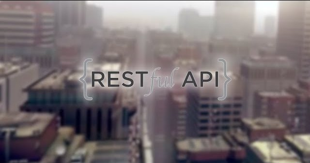

<div style="display:flex; justify-content: center; margin-bottom:10px">
 
</div>

<h1 align="center">RESTful with Node.js</h1>

## :dart: About

Webservice RESTful with NodeJS, Restify, MySQL and Typescript

## :rocket: Technologies

The following tools were used in this project:

- [TypeScript](https://www.typescriptlang.org/)
- [Node.js](https://nodejs.org/en/)
- [Restify](http://restify.com/)
- [AvaJS](https://github.com/avajs/ava)

## :white_check_mark: Requirements

Before starting :checkered_flag:, you need to have [Git](https://git-scm.com) and [Node](https://nodejs.org/en/) installed.

## :checkered_flag: Starting

```bash
# Clone this project
$ git clone https://github.com/davi1985/restful-ws-vedovelli

# Access
$ cd restful-ws-vedovelli

# Install dependencies
$ yarn

# Run the project
$ yarn dev

# The server will initialize in the <http://localhost:3333>
```

Made with :heart: by <a href="https://github.com/davi1985" target="_blank">Davi Silva</a>

&#xa0;

<a href="#top">Back to top</a>
